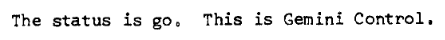
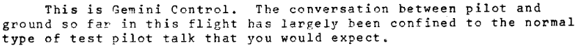

# Ignition: Python3 Gemini Protocol Client Transport Library


Ignition is a simple but powerful transport library for Python3 clients using the recently designed [Gemini protocol](https://gemini.circumlunar.space/). This project intends to implement all of the [transport specifications](https://gemini.circumlunar.space/docs/specification.html) (sections 1-4) of the Gemini protocol and provide an easy-to-use interface, so as to act as a building block in a larger application.

If you're building a Python3 application that uses Gemini, Ignition is your gateway to the stars, in very much the same way that [requests](https://requests.readthedocs.io/en/master/) is for HTTP and **gopherlib** is for Gopher.

In order to provide a best-in-class interface, this library does not implement the other parts of a typical client (including user interface and/or command line interface), and instead focuses on providing a robust programmatic API interface.  This project also assumes that different user interfaces will have different requirements for their display of text/gemini files (.gmi), and/or other mime-types, and as such considers this portion of the specification beyond the scope of this project.

## Project Status




Ignition is currently in the final stages of pre-Alpha development.  It is not yet released!  You use Ignition at your own risk and agree to monitor this repository for changes until a stable version is released.

## Installation
⚠ Ignition currently supports Python versions 3.7 - 3.9.

You will be able to install Ignition via pip shortly.  I typically recommend you do this within a [virtual environment](https://packaging.python.org/guides/installing-using-pip-and-virtual-environments/)

```bash
pip install ignition-gemini
```

If you prefer to install from source, you can clone and install the repository:

```bash
git clone https://github.com/cbrews/ignition.git
cd ignition
python3 setup.py install
```

## Simple Usage
The most basic usage of Ignition allows the user to create a request and get a response back from a remote Gemini capsule:
```python
import ignition

# Fetch capsule content
response = ignition.request('//gemini.circumlunar.space')

# Print full response from remote capsule
print(response)
```
[source](examples/simple-usage.py)

In **all** cases, Ignition assumes that the specified endpoint and protocol will respond over the Gemini protocol, so even if you provide a different protocol or port, it will assume that the endpoint is a Gemini capsule.

## Key Features



✅ Ignition currently supports the following features:
* Basic request/response connectivity to a Gemini-enabled server.
* Basic URL parsing mechanics to allow for specifying protocol, host, port, path, and query params, as per [RFC-3986](https://tools.ietf.org/html/rfc3986)
* Optional referer URL handling.  Ignition allows the user to pass a path & referer URL and can construct the new path, to simplifying the resolution of links on a Gemini capsule page.
* Decoding of body responses on successful (20) response from Gemini servers.
* Trust-on-first-use certificate verification handling scheme.
* Fully-featured response objects for each response type.
* Robust, human-readable error management and custom error handling for failure cases beyond the scope of the protocol.

❌ The following Gemini features will *not* be supported by Ignition:
* Behavioral processing/handling of specific response types from Gemini capsules, including:
  * Generation of client certificates & automatic resubmission.
  * Automatic redirection following on 3x responses.
* Body parsing & display of text/gemini mime types
* Command line interface
* Advanced session & history management
* Support for other protocols

⚠ These features are not currently supported but may be supported in the future:
* Alternative certificate verification schemes
* Titan protocol

## Advanced Usage
More advanced request usage:

```python
import ignition

response = ignition.request('/software', referer='//gemini.circumlunar.space:1965')

print("Got back response %s from %s" % (response.status, response.url))
# Got back a response 20 from gemini://gemini.circumlunar.space/software

if not response.success():
  print("There was an error on the response.")
else:
  print(response.data())
```

Passing a referer:
```python
import ignition

response1 = ignition.request('//gemini.circumlunar.space')
response2 = ignition.request('software', referer=response1.url)

print(response2)
```
[source](examples/using-referer.py)

More advanced response validation:
```python
import ignition

url = '//gemini.circumlunar.space'
response = ignition.request(url)

if response.is_a(ignition.SuccessResponse):
  print('Success!')
  print(response.data())

elif response.is_a(ignition.InputResponse):
  print('Needs additional input: %s' % (response.data()))

elif response.is_a(ignition.RedirectResponse):
  print('Received response, redirect to: %s' % (response.data()))

elif response.is_a(ignition.TempFailureResponse):
  print('Error from server: %s' % (response.data()))

elif response.is_a(ignition.PermFailureResponse):
  print('Error from server: %s' % (response.data()))

elif response.is_a(ignition.ClientCertRequiredResponse):
  print('Client certificate required. %s' % (response.data()))

elif response.is_a(ignition.ErrorResponse):
  print('There was an error on the request: %s' % (response.data()))
```
[source](examples/advanced-usage.py)

## API Documentation
Full API documentation for Ignition is available [here](./docs/api.md).

## Developers


Want to help contribute to Ignition?  See the [developer documentation](./docs/developer.md) for contribution guidelines, build processes, and testing.

## License
Ignition is licensed under [Mozilla Public License 2.0](https://www.mozilla.org/en-US/MPL/).

## Thank you
* *solderpunk* for leading the design of the [Gemini protocol](https://gemini.circumlunar.space/docs/specification.html), without which this project would not have been possible.
* *Sean Conman* for writing the [Gemini torture tests](gemini://gemini.conman.org/test/torture), which were instrumental in initial client testing.
* *Michael Lazar* for his work on [Jetforce](https://github.com/michael-lazar/jetforce), which helped testing along the way.

🔭 Happy exploring!
